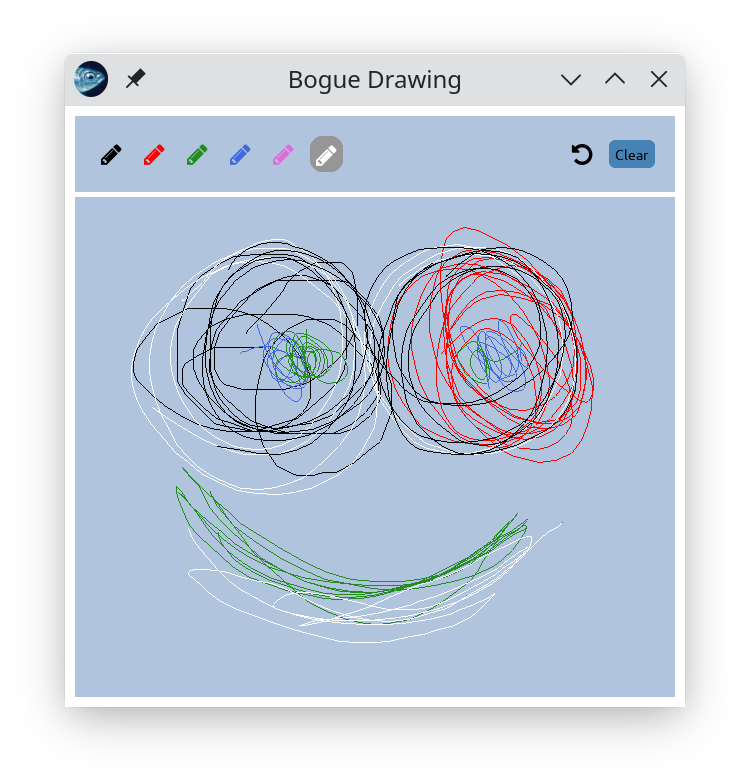

# drawing-demo

_Very basic drawing app to demonstrate the use of
[Bogue](https://github.com/sanette/bogue)._

Want to train your handwriting, or draw with constraints? You're on
the right spot. This app features:

* very fast reaction to mouse/touchscreen/stylus
* only thin strokes
* "Clear" button with confirmation popup
* a limited number of colors
* unlimited undo
* unlimited creativity!



## install

I don't have a standalone package. Help needed!

You need to install bogue (>= 20220408) and compile the drawing-demo with

```
dune exec ./drawing.exe
```
